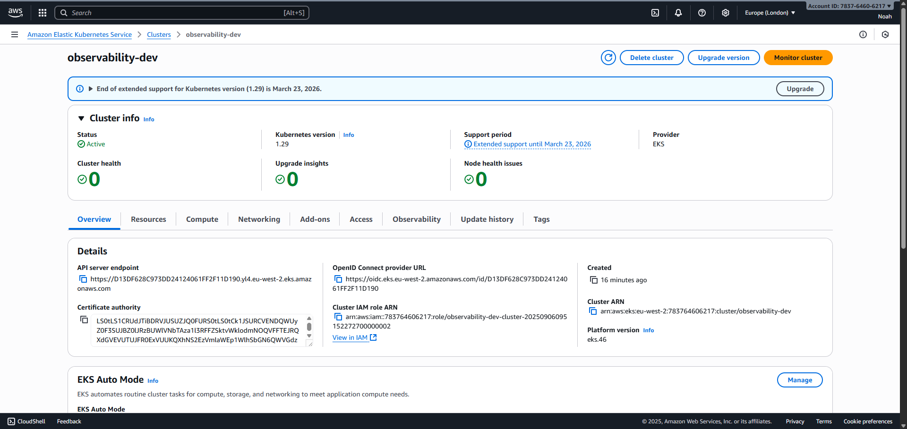
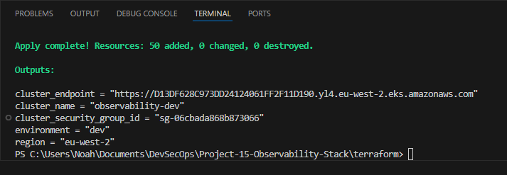
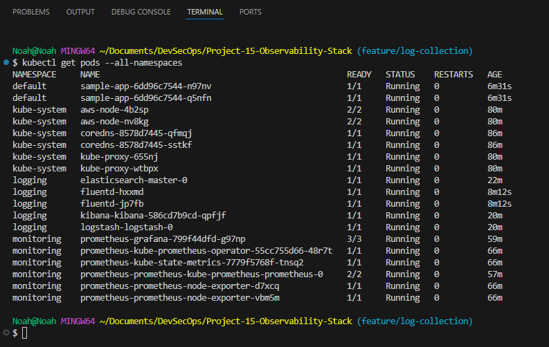
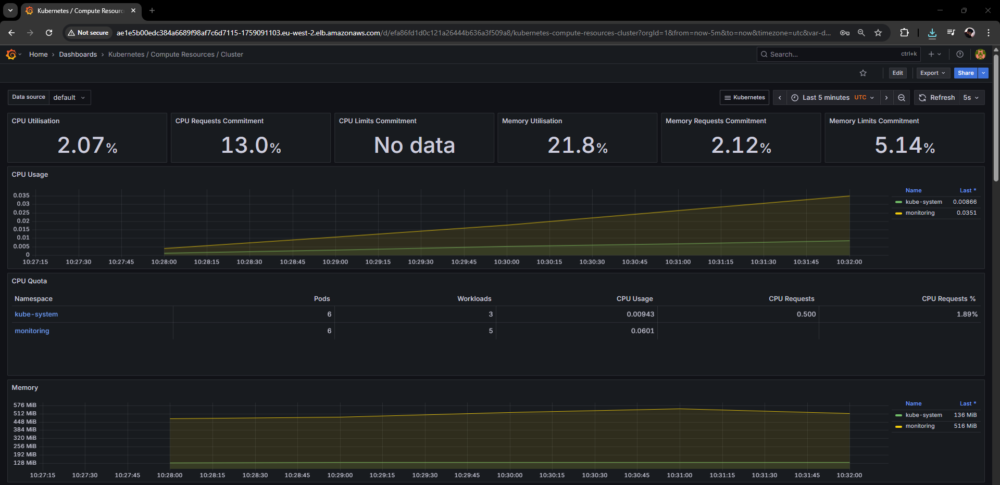
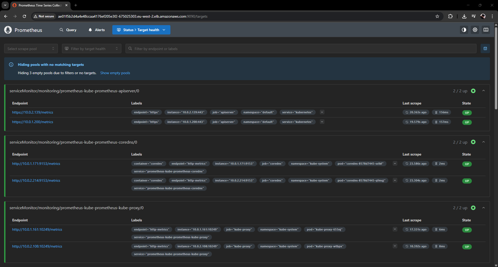
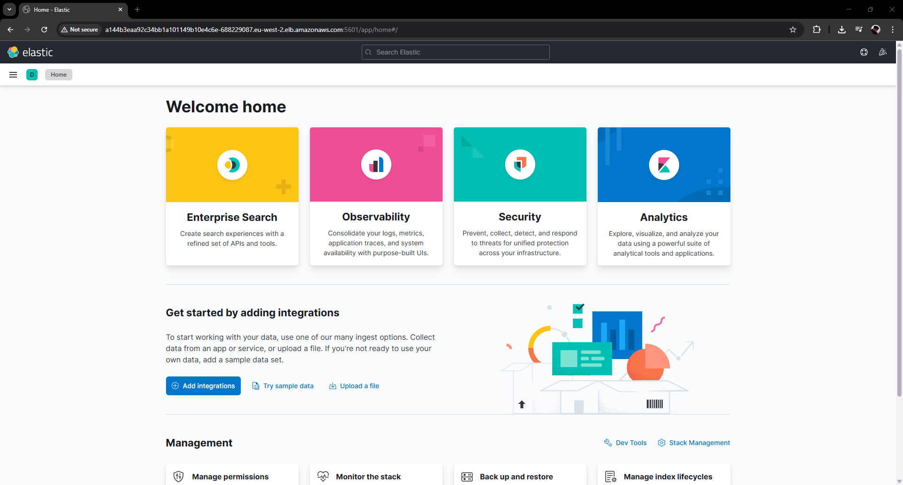
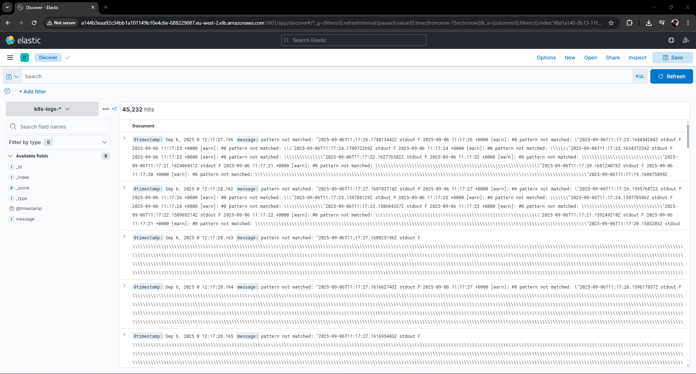
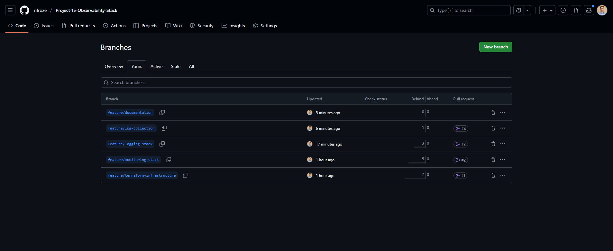

# Project 15: Observability Stack

Elasticsearch cluster on Kubernetes with Logstash and Kibana. Fluentd DaemonSet for log collection. Prometheus and Grafana for metrics. Multi-environment Terraform deployment.

## Technologies

AWS EKS • Terraform • Prometheus • Grafana • Elasticsearch • Logstash • Kibana • Fluentd • Kubernetes • Helm • Docker • Git

## Screenshots

